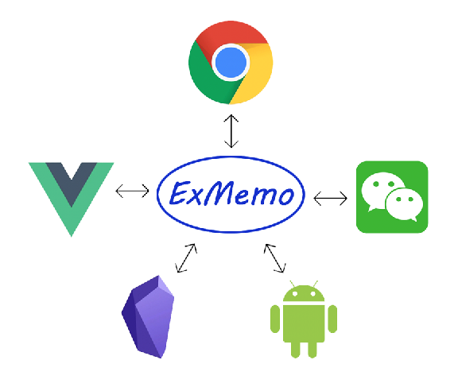
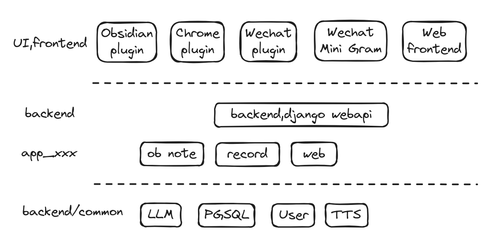

English | [中文简体](./README_cn.md)

## 1. Introduction

The [ExMemo Project](https://github.com/ExMemo/exmemo.git) is a personal knowledge management system designed to centralize and manage various types of information, including favorite texts, books, music, videos, web pages, work documents, and reflections on life. It also automates the categorization of specific items such as locations, phone numbers, and addresses, allowing for easy retrieval. By systematically integrating data, it breaks through cognitive limitations and uncovers intrinsic connections.

The system architecture comprises a database, backend, and multiple frontends. Distributed storage and databases are utilized to store user files, text, and corresponding vector data. Data storage can be deployed locally to ensure user privacy. The backend provides generic interfaces for CRUD operations on data and handles large model invocations and data processing. The system supports online large models such as OpenAI, Gemini, Qwen, and offline models like Ollama. Multiple frontends, including web services, WeChat bots, Obsidian plugins, and browser plugins, allow users to upload and download data.

`browser-exmemo-bmsync` is a Chrome extension based on ExMemo, designed to synchronize browser bookmarks to the database. This integration allows browser bookmark data (external data sources) to be aggregated into ExMemo's personal data platform, facilitating offline storage and convenient retrieval.

## 2. Key Features

- **Enhanced Synchronization Mechanism**: 
  - For first-time users, a simple click on the "Sync" button facilitates the effortless migration of all bookmark data to ExMemo's cloud-based database, enabling bulk import with a single action.
  - The system employs a sophisticated real-time monitoring mechanism that automatically triggers synchronization when bookmarks are added, deleted, or moved to new locations.
  - Currently implements one-way communication from browser bookmarks to database.

- **Bookmark Priority System**: 
  - Users can efficiently categorize bookmarks into "To Read" and "Favorites" states, with favorites representing higher priority items.
  - Bookmarks designated as "To Read" are intelligently archived into a dedicated "To Read" folder. If the folder does not already exist, the system automatically generates it.

- **Link Health Checker**: 
  - The system automatically identifies and flags invalid links within the database, maintaining data integrity.

- **Browse Count Tracking**:
  - Automatically tracks and records the number of times each bookmark is visited.

## 3. Installation and Configuration

### 3.1 Installation

1. Clone or download this repository.
2. Open Google Chrome and navigate to the Extensions Management page (`chrome://extensions/`).
3. Enable "Developer mode" in the top right corner.
4. Click "Load unpacked" and select the `browser-exmemo-bmsync` folder to install the extension.

### 3.2 Initial Setup

Upon first installation, input the server address (`addr`), username, and password as prompted.  
Restart Chrome to apply the changes.

## 4. Usage

- **Initial Manual Synchronization**: Manually trigger synchronization on first use.
- **Automatic Synchronization**: Subsequent changes are automatically synchronized.
- **Bookmark Categorization**: Tag bookmarks with types such as "To-Read" or "Favorites".

## 5. Future Enhancements

- Implement a configuration switch to choose whether to synchronize bookmark content.
- Ensure compatibility with more browsers.

## 6. License

This project is licensed under the terms of the GNU Lesser General Public License v3.0. For more details, please refer to the [LICENSE](./LICENSE) file.
